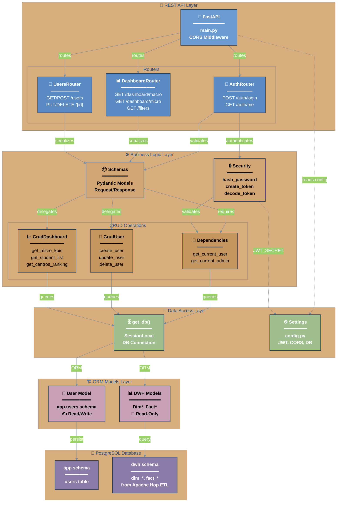

```mermaid

%%{init: {'flowchart': {'curve': 'linear'}, 'theme': 'base', 'themeVariables': { 'primaryColor': '#6B9BD1', 'primaryTextColor': '#fff', 'primaryBorderColor': '#2c3e50', 'lineColor': '#7a8b99', 'secondBorderColor': '#404040', 'fontFamily': 'arial'}}}%%

graph TD
    subgraph REST ["🔗 REST API Layer"]
        direction LR
        FastAPI["<b>🚀 FastAPI</b><br/>━━━━━━━━━━━<br/>main.py<br/>CORS Middleware"]
        
        subgraph Routers ["Routers"]
            AuthR["<b>🔐 AuthRouter</b><br/>━━━━━━━━━<br/>POST /auth/login<br/>GET /auth/me"]
            DashR["<b>📊 DashboardRouter</b><br/>━━━━━━━━━━━━<br/>GET /dashboard/macro<br/>GET /dashboard/micro<br/>GET /filters"]
            UsersR["<b>👥 UsersRouter</b><br/>━━━━━━━━━━<br/>GET/POST /users<br/>PUT/DELETE /{id}"]
        end
    end
    
    subgraph LOGIC ["⚙️ Business Logic Layer"]
        direction LR
        Schemas["<b>📦 Schemas</b><br/>━━━━━━━━━<br/>Pydantic Models<br/>Request/Response"]
        
        Security["<b>🔒 Security</b><br/>━━━━━━━━━<br/>hash_password<br/>create_token<br/>decode_token"]
        
        subgraph CRUD ["CRUD Operations"]
            Deps["<b>🔑 Dependencies</b><br/>━━━━━━━━━<br/>get_current_user<br/>get_current_admin"]
            
            CrudUser["<b>👤 CrudUser</b><br/>━━━━━━━━<br/>create_user<br/>update_user<br/>delete_user"]
            
            CrudDash["<b>📈 CrudDashboard</b><br/>━━━━━━━━━━━━<br/>get_micro_kpis<br/>get_student_list<br/>get_centros_ranking"]
        end
    end
    
    subgraph DATA ["💾 Data Access Layer"]
        direction LR
        GetDB["<b>🗄️ get_db()</b><br/>━━━━━━━━━<br/>SessionLocal<br/>DB Connection"]
        
        Settings["<b>⚙️ Settings</b><br/>━━━━━━━━<br/>config.py<br/>JWT, CORS, DB"]
    end
    
    subgraph MODELS ["🏗️ ORM Models Layer"]
        direction LR
        UserModel["<b>👤 User Model</b><br/>━━━━━━━━━━<br/>app.users schema<br/>✍️ Read/Write"]
        
        DWHModels["<b>📊 DWH Models</b><br/>━━━━━━━━━━━<br/>Dim*, Fact*<br/>📖 Read-Only"]
    end
    
    subgraph DB ["💎 PostgreSQL Database"]
        direction TB
        AppSchema["<b>app schema</b><br/>━━━━━━━━<br/>users table"]
        
        DWHSchema["<b>dwh schema</b><br/>━━━━━━━━━━<br/>dim_*, fact_*<br/>from Apache Hop ETL"]
    end
    
    %% REST connections
    FastAPI -->|routes| AuthR
    FastAPI -->|routes| DashR
    FastAPI -->|routes| UsersR
    
    %% Router to Logic
    AuthR -->|validates| Schemas
    AuthR -->|authenticates| Security
    DashR -->|serializes| Schemas
    UsersR -->|serializes| Schemas
    
    %% Logic layer internal
    Schemas -->|requires| Deps
    Schemas -->|delegates| CrudUser
    Schemas -->|delegates| CrudDash
    Security -->|validates| Deps
    
    %% To Data Access
    Deps -->|queries| GetDB
    CrudUser -->|queries| GetDB
    CrudDash -->|queries| GetDB
    
    FastAPI -.->|reads config| Settings
    Security -.->|JWT_SECRET| Settings
    
    %% To Models
    GetDB -->|ORM| UserModel
    GetDB -->|ORM| DWHModels
    
    %% To Database
    UserModel -->|persist| AppSchema
    DWHModels -->|query| DWHSchema
    
    %% Styling
    classDef rest fill:#6B9BD1,stroke:#2c3e50,stroke-width:2px,color:#fff,font-weight:bold
    classDef router fill:#5A8AC4,stroke:#2c3e50,stroke-width:1.5px,color:#fff
    classDef logic fill:#D4A574,stroke:#2c3e50,stroke-width:2px,color:#000,font-weight:bold
    classDef crud fill:#C59560,stroke:#2c3e50,stroke-width:1.5px,color:#000
    classDef data fill:#9FBF8F,stroke:#2c3e50,stroke-width:2px,color:#fff,font-weight:bold
    classDef models fill:#C9A2B8,stroke:#2c3e50,stroke-width:2px,color:#000,font-weight:bold
    classDef db fill:#8B7BA8,stroke:#2c3e50,stroke-width:2px,color:#fff,font-weight:bold
    
    class FastAPI rest
    class AuthR,DashR,UsersR router
    class Schemas,Security logic
    class Deps,CrudUser,CrudDash crud
    class GetDB,Settings data
    class UserModel,DWHModels models
    class AppSchema,DWHSchema db
```
